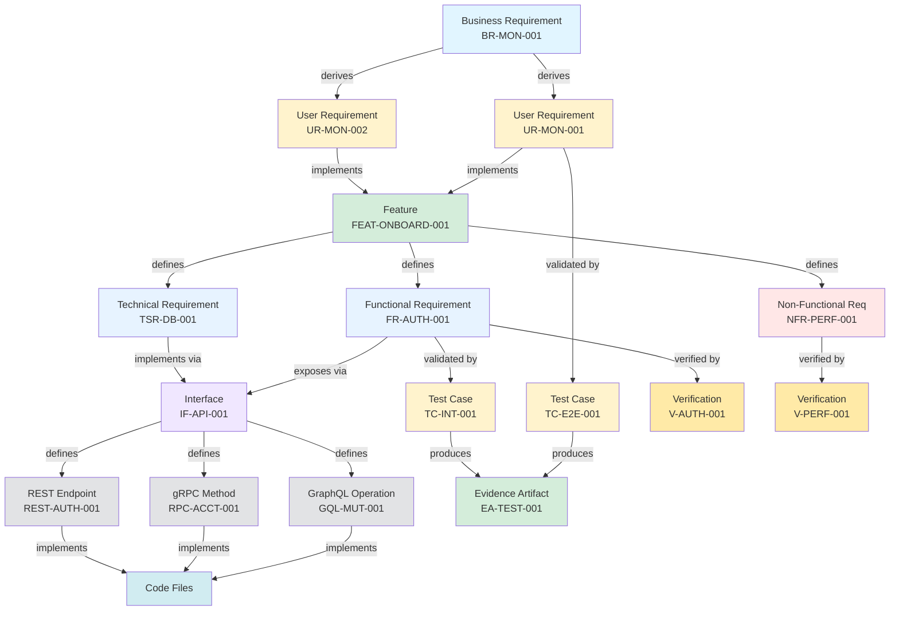
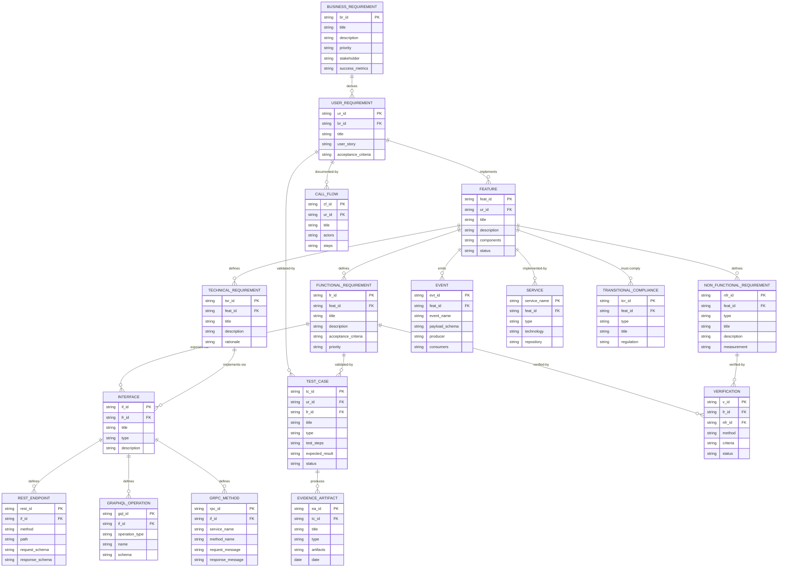
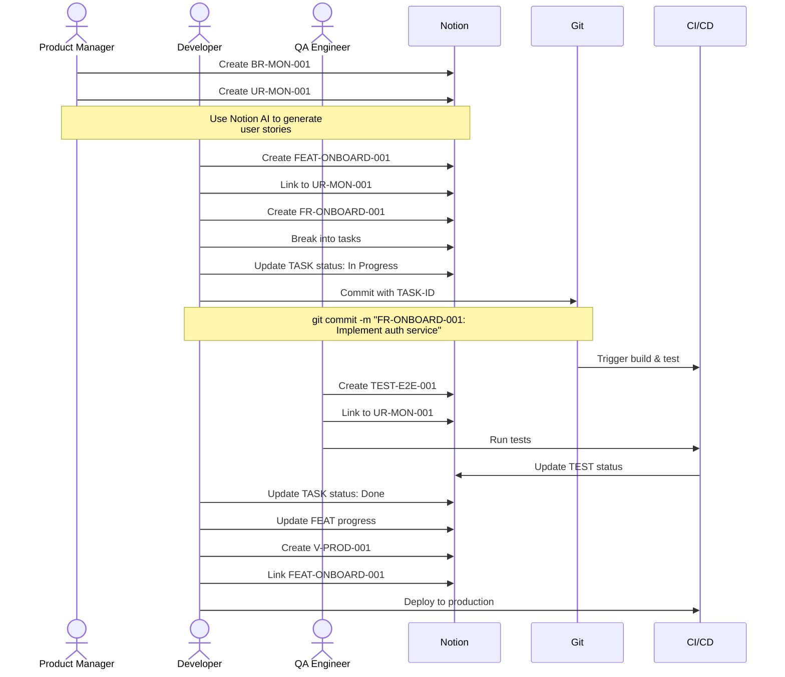
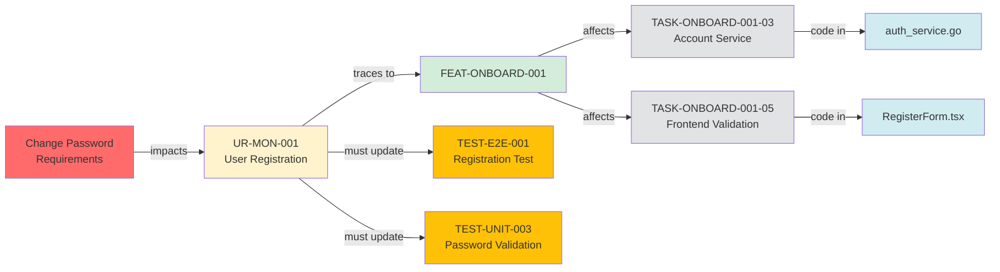
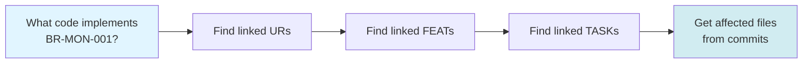
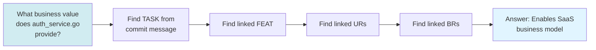
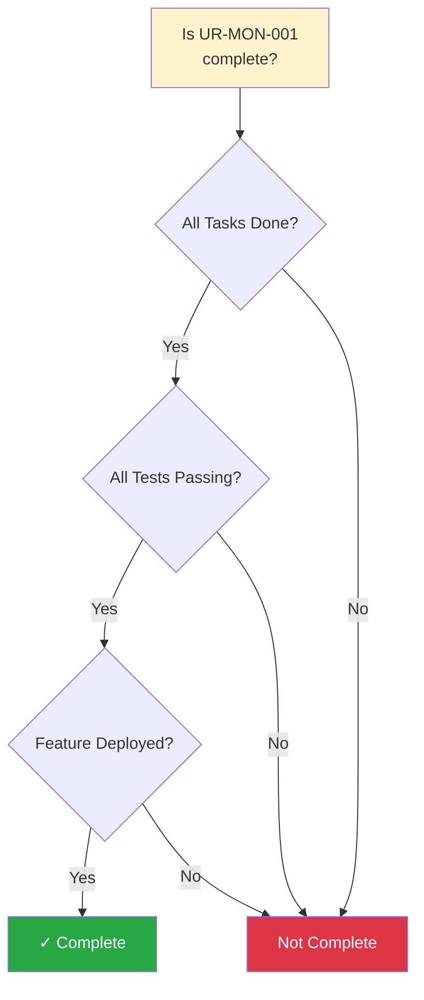
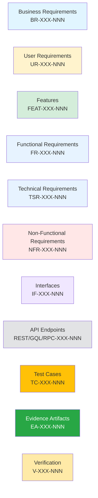
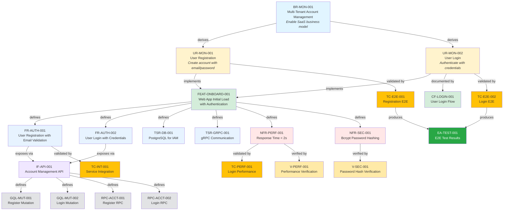

# Golden Thread Traceability - Visual Diagrams

## Complete Traceability Flow

## Database Relations

## Developer Workflow

## Impact Analysis Example

## Traceability Query Paths

### Forward Tracing (Business → Code)

### Backward Tracing (Code → Business)

### Completeness Check

## Legend

---

## How to Use These Diagrams

### In Documentation
Copy the Mermaid code blocks into any Markdown file. They render automatically in:
- GitHub
- GitLab
- Notion (with Mermaid support)
- VS Code (with Mermaid extension)
- Documentation sites (MkDocs, Docusaurus, etc.)

### In Presentations
1. Render diagram in a Mermaid viewer
2. Take screenshot
3. Add to slides

### In Notion
1. Create a code block
2. Set language to "Mermaid"
3. Paste diagram code

### Live Editing
Use online editors:
- https://mermaid.live/
- https://mermaid-js.github.io/mermaid-live-editor/

---

## Example: Real Traceability

Here's the actual traceability for FEAT-ONBOARD-001:

---

**Pro Tip**: Keep these diagrams updated as your traceability model evolves. They're invaluable for onboarding and stakeholder communication!
